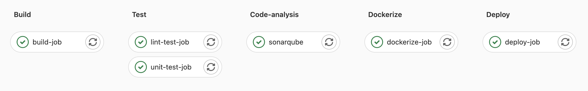

# in-memory-store [](https://twitter.com/intent/tweet?text=Check%20out%20this%20cool%20project&url=https://gitlab.com/mfcekirdek/in-memory-store&hashtags=project,opensource)


## Description
A simple in memory key value store application.

## Table of content
- [Api doc](api/swagger.yaml)
- [Go doc](#go-doc)
- [Project setup](#project-setup)
- [Run lint checks](#run-lint-checks)
- [Run Tests](#run-tests)
- [Build project](#build-project)
- [Run](#run)
- [Built With](#built-with)
- [CI/CD Processes](#cicd-processes)
- [Contributing](#contributing)
- [License](#license)
- [Get Help](#get-help)

### Go doc
To run a go doc server locally: (godoc must be installed)
``` console
godoc -http=localhost:6060
```
Check docs from
http://localhost:6060/pkg/gitlab.com/mfcekirdek/in-memory-store/?m=all

### Project setup
``` console
go mod download
```

### Run lint checks

golangci-lint should be installed before running tests.

https://golangci-lint.run/usage/install/
``` console
make lint
```

### Run tests

Mockgen framework should be installed before running tests. Follow the instructions in this [link](https://github.com/golang/mock).
   
Generate mocks and run tests:
``` console
make test
```

### Build project
``` console
make build
```

### Run
You can simply run the app with default configurations:
``` console
make run
```

Or set configs by exporting environment variables.
``` console
export IS_DEBUG=true
export APP_NAME=kv-store
export PORT=8080
export STORAGE_DIR_PATH=storage
export SAVE_TO_FILE_INTERVAL=10
make run
```

### Built With
1. Go
    - Go standard library
    - github.com/spf13/viper --> For reading env configs at startup.
    - github.com/k0kubun/pp --> For printing app configs in a pretty format.
    - github.com/golang/mock --> For mocking components in tests.

2. Other Technologies and Components
   - Swagger for API design and documentation.
   - Postman
     - You can find exported Postman collection file [here](api/KVStore.postman_collection.json)
   - godoc for code documentation.
     - pkg/gitlab.com/mfcekirdek/in-memory-store
     - Too see documentation of not exported packages, ?m=all parameter to the end of the url.
        - Example: http://localhost:6060/pkg/gitlab.com/mfcekirdek/in-memory-store/?m=all
   - Docker
      - build and push images to the private gitlab registry.
      - tag the image with branch name (main) and pipeline id
         - image:
            - registry.gitlab.com/mfcekirdek/in-memory-store/main 
   - Kubernetes (Created a cluster at Digital Ocean with 2 nodes [167.71.39.58, 104.248.33.151])
     - Namespace: in-memory-store-30556712-test
     - Deployment (Pod.container.image: registry.gitlab.com/mfcekirdek/in-memory-store/main)
     - Service
        - NodePort Service for deployment (Port: 30000)
   - Sonarqube for code coverage assessment 
     - Pipeline fails if the coverage decreases under 80%
     - Deployed to kubernetes cluster
     - Url: http://104.248.103.208:9000/
     - Credentials:
       - admin
       - 'c_wQM?FW/ck5Sc`
   - GitLab CI/CD Pipeline for automation

## CI/CD Processes



- [x] CI/CD Pipeline steps
    - [x] build
        - [x] build-job
    - [x] test
        - [x] unit-test-job
        - [x] lint-test-job
    - [x] code-analysis
        - [x] sonarqube
    - [x] dockerize
        - [x] dockerize-job
    - [x] deploy
        - [x] deploy-job

## Contributing

#### Issues
In the case of a bug report, bugfix or a suggestions, please feel very free to open an issue.

#### Pull request
Pull requests are always welcome, and I'll do my best to do reviews as fast as I can.

## License
This project is licensed under the [MIT License](https://gitlab.com/mfcekirdek/in-memory-store/-/blob/main/LICENSE)

## Get Help
- Contact me on mfcekirdek@gmail.com
- If appropriate, [open an issue](https://gitlab.com/mfcekirdek/in-memory-store/-/issues) on GitLab
